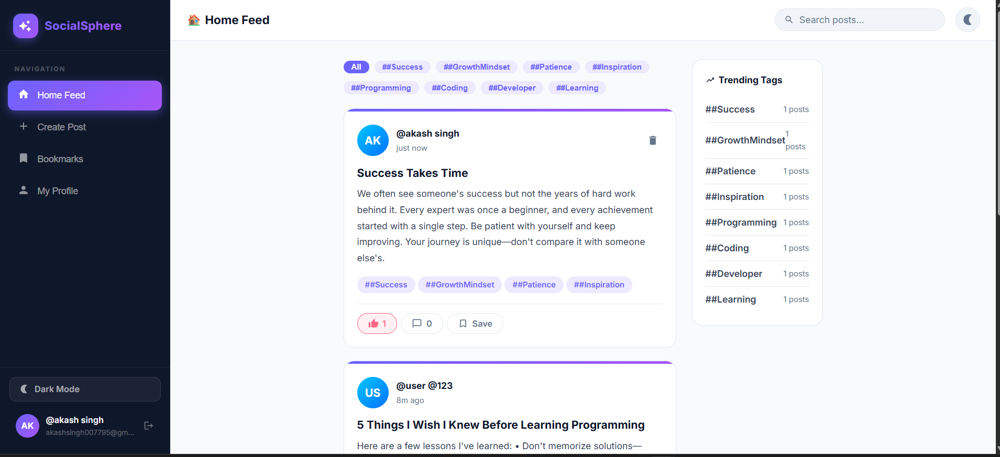
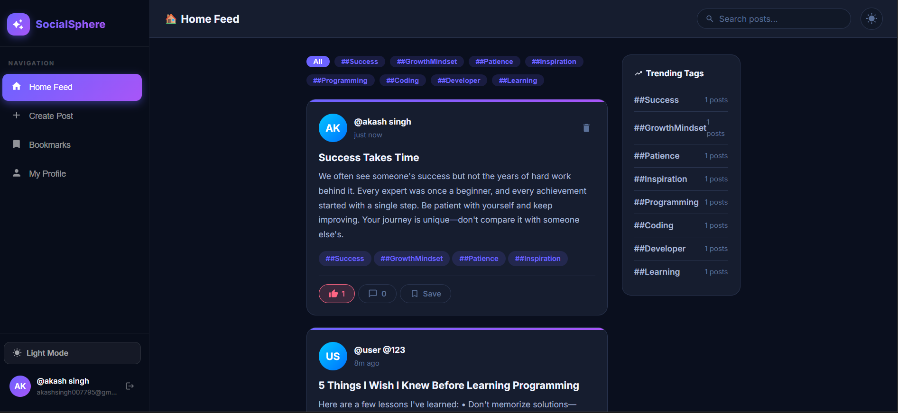
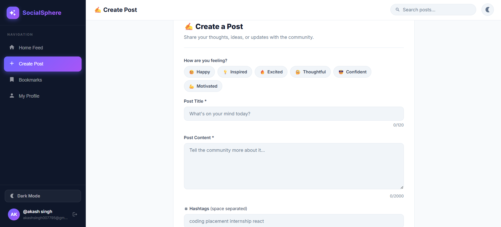
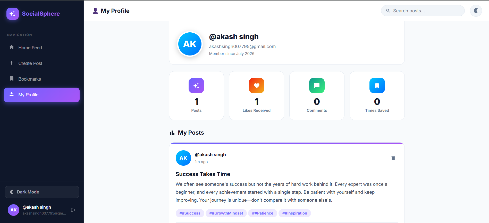
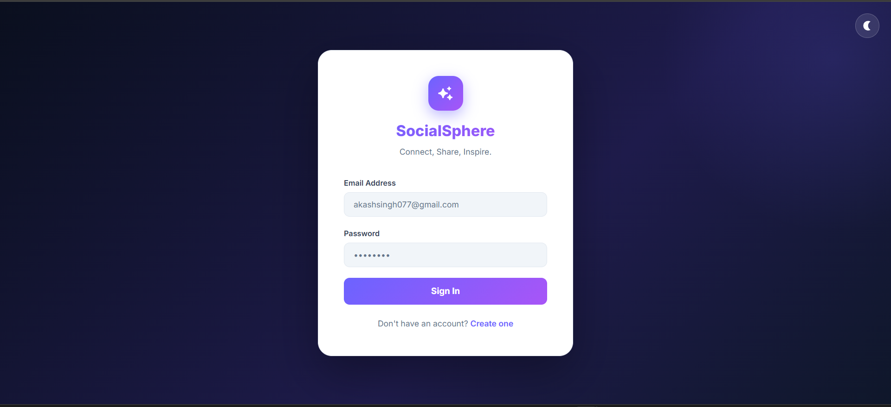

<div align="center">

# 🌐 SocialSphere

### Modern Full Stack MERN Social Media Platform

A modern social media platform built using the **MERN Stack** that allows users to connect, share posts, interact with the community, and express themselves through a beautiful responsive interface.

---


---

### 🚀 Full Stack MERN Project

Built using React • Node.js • Express.js • MongoDB Atlas

⭐ If you like this project, don't forget to star the repository.

</div>

---

# 📖 About The Project

SocialSphere is a modern social networking platform where users can create posts, interact with others, like posts, bookmark content, comment on posts, and personalize their experience with dark mode, mood selection, and live location sharing.

The application is designed with a scalable full-stack architecture using React for the frontend and Node.js + Express for the backend while MongoDB Atlas stores application data securely.

The goal of this project is to simulate a real-world social media platform with production-level architecture and modern UI/UX.

---

# 🎯 What SocialSphere Solves

✔ Community interaction

✔ Social content sharing

✔ Personalized profiles

✔ Dark & Light mode

✔ Live location sharing

✔ Responsive user experience

✔ Modern UI Design

✔ Secure authentication

✔ Fast post discovery

✔ Social engagement

---

# 🌐 Live Demo

### Frontend

Coming Soon (Vercel)

### Backend

Coming Soon (Render)

---

# 📸 Application Preview

## 🏠 Home Feed



---

## 🌙 Dark Mode



---

## ✍️ Create Post



---

## 👤 User Profile



---

## 🔐 Login Page



---

# ✨ Features

## 🔐 Authentication

- User Registration
- User Login
- Logout
- Session Based Authentication
- Password Encryption using bcrypt
- Protected Routes

---

## 📝 Post Management

- Create Posts
- Delete Posts
- View Feed
- Search Posts
- Hashtag Filtering
- Trending Tags

---

## ❤️ Social Features

- Like Posts
- Unlike Posts
- Bookmark Posts
- Comment on Posts
- User Profiles
- Personal Dashboard

---

## 🎨 User Experience

- Responsive UI
- Glassmorphism Design
- Dark Mode
- Light Mode
- Toast Notifications
- Beautiful Animations
- Smooth Hover Effects

---

## 📍 Advanced Features

- Live Location Sharing
- Mood Selection
- Profile Statistics
- Saved Posts
- Search Functionality
- Pagination

---

# 🛠 Tech Stack

| Layer | Technology |
|--------|------------|
| Frontend | React 18 |
| Build Tool | Vite |
| Styling | CSS3 |
| Routing | React Router |
| Backend | Node.js |
| Framework | Express.js |
| Database | MongoDB Atlas |
| ODM | Mongoose |
| Authentication | Express Session |
| Password Security | bcrypt |
| HTTP Client | Axios |
| Icons | React Icons |
| Version Control | Git + GitHub |

---

# 🏗 System Architecture

```
            User
              │
              ▼
      React + Vite Frontend
              │
          Axios Requests
              │
      Express REST API
              │
      Session Authentication
              │
        MongoDB Atlas
```

---

# ⚙️ Backend Engineering Highlights

The backend is designed using a modular architecture that follows industry best practices for scalability and maintainability.

### 🔐 Authentication System

- User Registration
- User Login
- Secure Logout
- Session-Based Authentication
- Password Hashing using bcrypt
- Protected Routes
- Persistent User Sessions

---

### 📝 Post Management

- Create Posts
- Delete Posts
- Fetch All Posts
- Fetch User Posts
- Like / Unlike Posts
- Bookmark Posts
- Comment System
- Search Functionality
- Hashtag Filtering
- Pagination Support

---

### 📍 Live Location Feature

Users can attach their current location while creating a post.

**Workflow**

```
Browser
     │
Geolocation API
     │
Latitude & Longitude
     │
OpenStreetMap Reverse Geocoding
     │
Readable Address
     │
Stored in MongoDB
```

Location appears inside every post and can be opened directly in Google Maps.

---

### 🌙 Dark / Light Mode

Implemented using

- React Context API
- CSS Variables
- LocalStorage

Theme preference is automatically saved and restored whenever the user revisits the application.

---

### 🗄 Database Design

Collections

- Users
- Posts
- Sessions

Post document contains

- Title
- Description
- Hashtags
- Mood
- Location
- Likes
- Comments
- Bookmarks
- Created Date

---

### 🔒 Security

- Password Encryption
- Protected Routes
- Session Authentication
- MongoDB Validation
- Secure Cookies
- Middleware Based Authorization

---

# ⚛️ Frontend Engineering Highlights

The frontend is built using **React 18** with reusable components and clean state management.

### React Concepts Used

- Functional Components
- React Router DOM
- React Context API
- useState
- useEffect
- Custom Hooks

---

### UI Components

- Sidebar
- Navbar
- Post Card
- Toast Notifications
- Create Post Form
- Profile Dashboard
- Bookmark Page

---

### User Experience

- Responsive Layout
- Mobile Friendly
- Smooth Animations
- Glassmorphism Cards
- Gradient UI
- Interactive Buttons
- Loading States

---

# 🔑 REST API Overview

## Authentication

| Method | Endpoint |
|---------|----------|
| POST | /api/auth/register |
| POST | /api/auth/login |
| POST | /api/auth/logout |
| GET | /api/auth/me |

---

## Posts

| Method | Endpoint |
|---------|----------|
| GET | /api/posts |
| POST | /api/posts |
| DELETE | /api/posts/:id |

---

## Interactions

| Method | Endpoint |
|---------|----------|
| PATCH | /api/posts/:id/like |
| PATCH | /api/posts/:id/bookmark |
| POST | /api/posts/:id/comments |

---

# 📂 Project Structure

```
SocialSphere-FullStack
│
├── backend
│   ├── middleware
│   ├── models
│   ├── routes
│   ├── app.js
│   ├── package.json
│   └── .env
│
├── frontend
│   ├── src
│   │   ├── assets
│   │   ├── component
│   │   ├── hooks
│   │   ├── pages
│   │   ├── App.jsx
│   │   └── main.jsx
│   ├── public
│   └── package.json
│
├── screenshots
├── README.md
└── .gitignore
```

---

# 🚀 Installation

## Clone Repository

```bash
git clone https://github.com/akashsingh77-ux/SocialSphere-FullStack.git
```

Move into project

```bash
cd SocialSphere-FullStack
```

---

## Backend Setup

```bash
cd backend
npm install
```

Create a `.env` file

```env
MONGO_URI=your_mongodb_connection_string
SESSION_SECRET=your_secret_key
PORT=5000
```

Start backend

```bash
npm run dev
```

---

## Frontend Setup

```bash
cd frontend
npm install
npm run dev
```

Frontend runs on

```
http://localhost:5173
```

Backend runs on

```
http://localhost:5000
```

---

# 🌟 Key Highlights

✅ Full Stack MERN Application

✅ Modern Responsive UI

✅ Session-Based Authentication

✅ Secure Password Hashing

✅ RESTful API Architecture

✅ MongoDB Atlas Integration

✅ Dark & Light Theme

✅ Live Location Sharing

✅ Mood Selection

✅ Bookmarks & Comments

✅ Search & Hashtag Filtering

✅ Profile Dashboard

✅ Responsive Mobile Design

---

# 🚀 Deployment

## Frontend (Vercel)

```bash
cd frontend
npm run build
```

Deploy the **frontend** folder to **Vercel**.

---

## Backend (Render)

Deploy the **backend** folder as a **Web Service** on Render.

### Environment Variables

```env
MONGO_URI=your_mongodb_connection_string
SESSION_SECRET=your_secret_key
PORT=5000
```

---

# 💡 Interview Highlights

This project demonstrates practical experience with:

- Full Stack MERN Development
- Authentication & Authorization
- Session Management
- REST API Design
- CRUD Operations
- MongoDB Atlas
- React Context API
- Protected Routes
- Responsive UI Design
- State Management
- Browser Geolocation API
- Reverse Geocoding
- Production Deployment
- Git & GitHub

---

# 📈 Future Improvements

- 📷 Image Uploads using Cloudinary
- 💬 Real-Time Chat using Socket.io
- 🔔 Push Notifications
- 👥 Friend Request System
- ❤️ Follow / Unfollow Users
- 📸 Stories Feature
- 🎥 Video Sharing
- 📱 Progressive Web App (PWA)
- 🤖 AI Content Suggestions
- 📊 Admin Dashboard
- 🌍 Multi-Language Support

---

# 📊 Project Statistics

| Category | Details |
|----------|---------|
| Architecture | MERN Stack |
| Authentication | Session Based |
| Database | MongoDB Atlas |
| API Style | REST |
| UI | Responsive |
| Theme | Dark & Light |
| Deployment | Vercel + Render |
| Version Control | Git & GitHub |

---

# 🤝 Contributing

Contributions are always welcome.

If you'd like to improve SocialSphere:

1. Fork the repository
2. Create a feature branch

```bash
git checkout -b feature-name
```

3. Commit your changes

```bash
git commit -m "Add new feature"
```

4. Push the branch

```bash
git push origin feature-name
```

5. Open a Pull Request

---

# 👨‍💻 Author

## Akash Singh

Computer Science Engineering Student

National Institute of Technology Agartala

### Connect with me

**GitHub**

https://github.com/akashsingh77-ux

---

# ⭐ Support

If you found this project helpful, please consider giving it a ⭐ on GitHub.

It motivates me to build more open-source projects and improve them further.

---

<div align="center">

## 🚀 Thank You for Visiting!

### Made with ❤️ by AKASH SINGH using React, Node.js, Express.js & MongoDB

⭐ **Don't forget to Star this Repository!** ⭐

</div>